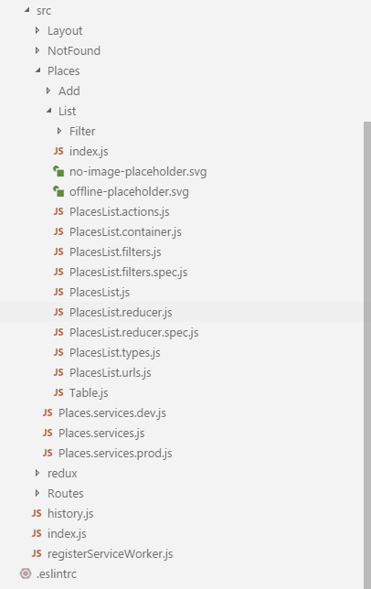

# Demo application

> AXA France Sample App React is an template/best-practices for **AXA's Intranet** new projects based on **React**.

## Table of contents

0.  <a href="#demo">Demo</a>
1.  <a href="#quick-start">Quick Start</a>
1.  <a href="#philosophy">Philosophy</a>
1.  <a href="#stack">Stack</a>
1.  <a href="#code-style">Tabs or spaces?</a>
1.  <a href="#app">Structuring your app</a>

# Demo

- [Online demo](https://axaguildev.github.io/react-toolkit/latest/demo/index.html)
- [Source code ](./examples/demo)


# Quick start

- [How to run the demo](../CONTRIBUTING.md)

# Philosophy

**The demo** aims to spread best-practices/standards among AXA projects. Although the name would suggest, you should not use this project as an starting point, instead get _inspired_ by it. ✨

This app is a combination of many frameworks/libraries. In order to keep every new project as independent and easy to update as possible, we've decided to not override any framework or library that our projects depend on.

That said, this project was bootstrapped with [Create React App](https://github.com/facebookincubator/create-react-app). Feel free to use `create-react-app` and `eject` if its configuration does not require your project needs (we hardly doubt it ;)) or if you are a `webpack` hero.

This document describe only "best practice" because **Front stacks** evolve very quickly. It is the Front end job (html/css/javascript) to maintain the web application up to date with the best practice and its knowledge.

# Stack

- **Tools**
- [**npm**](https://www.npmjs.com/get-npm)
- [**create-react-app**](https://github.com/facebookincubator/create-react-app)
- [**ESLint**](http://eslint.org/): Linting utility for JavaScript and JSX
- [**Prettier**](https://github.com/prettier/prettier): Code formatter
- **Language**
  - Javascript (**ES6+**)
- **Stack React**
- [**React**](https://facebook.github.io/react/): React official library
- [**react-router**](https://github.com/ReactTraining/react-router): Router
- [**Storybook**](https://github.com/storybooks/storybook): Interactive development & testing environment for React and React-Native UI components
- **Test**
- **Jest**
- **Enzyme**
- **Chai**
- **AXA**
- **@axa-fr/react-toolkit-all**: AXA Design System

### Prefer the use **React Context api** over **Redux**.

- Redux was the only way before Context api to share high level state data.
- [**You migth not need redux**](https://medium.com/@dan_abramov/you-might-not-need-redux-be46360cf367) : Redux is often missused because not very understod by developpers

**Shared context** are rare and introduce complexity. You need to have in mind that local context is easier and simple to develop and maintain and to use. Local state is in reality the major case of the needs. Do not think optimization, think simple. Simple code is simpler to optimize!

### Prefer the use **Hooks** over **Recompose**.

Recompose is great, feel free to continue to use it. But Recompose it is deprecated and hooks are still in alpha. We may advise to use Hooks in order to prevent from futur technical debs.

# Tabs or spaces?

Consistency is key. We follow some of the most common code style guidelines to front-end development:

- [Airbnb Javascript Style guide](https://github.com/airbnb/javascript)
- [React Airbnb style guide](https://github.com/airbnb/javascript/tree/master/react)

## Code styling tools

- [**EditorConfig**](http://editorconfig.org/): Because we live in a free world and we pick our editor but we love consistency
- [**ESLint**](http://eslint.org/): Lint your code (IDE/git hook pre-commit)
- [**Prettier**](https://github.com/prettier/prettier): Format (IDE/git hook pre-commit)
- [**prettier-eslint**](https://github.com/prettier/prettier-eslint): Formats your JavaScript using Prettier followed by `eslint --fix` :D (Use this package or add `eslint --fix` on your git hook pre-commit);

---

# Structuring your app

One of the most important things that React introduce to front-end development is building UI by assembling **components**!

Keeping that in mind, we strongly suggest to structure your app by organizing your folders/files by _what they do_ and not by their category.

Each component should be the maximum autonomous as possible. You should be able to externalize or move a compoment very easily. Think functionnality and organize linked functionalities together (for example, you don't set up a bed in a kitchen).

Let's see some examples:

## Folders

- **Layout**
  - Footer/
  - Header/
- **Places**
  - List/
  - Add/
  - Edit/
  - Remove/

## Functionnal programming

React is thought to help developper to develop in **Functionnal** way !

- Prefer to code using [**Pure Function**](https://medium.com/javascript-scene/master-the-javascript-interview-what-is-a-pure-function-d1c076bec976). Pure function are easy to code and test.
- Do not use mock in your [Unit Test](https://medium.com/javascript-scene/mocking-is-a-code-smell-944a70c90a6a). Functional code do not require mocks.
- Prefer code pure function in TDD
- React component should be stateless

**bad-code.js**

```javascript
export const postService = async data => {
  const headers = new Headers({
    'Content-Type': 'application/json',
  });
  // Because of this fetch, the function is not pure and not testable easily
  return fetch(`services`, {
    method: 'post',
    headers,
    withCredentials: true,
    body: JSON.stringify(data),
  });
};
```

**good-code.js**

```javascript
export const postService = fetch => async data => {
  const headers = new Headers({
    'Content-Type': 'application/json',
  });
  // Now fetch is injected by composition and  the function is pure and easy to test
  return fetch(`services`, {
    method: 'post',
    headers,
    withCredentials: true,
    body: JSON.stringify(data),
  });
};
```

## File naming conventions

By convention, uppercase the first letter, use the component name to name it. Compose the name with its category to help identifying its content.

e.g. <br>
Calendar.**[type of file]**.js <br>
Calendar-grid.**[type of file]**.js

```javascript
Calendar.actions.js;
Calendar.container.js;
Calendar.filters.js;
Calendar.routes.js;
Calendar.reducer.js;
Calendar.filter.js;
Calendar.urls.js;
Calendar.services.js;
index.js;
Calendar.scss;
```

## File roles



- **index.js** : Exposes the public interface of your component. Other components must use the public `index.js` and do not access an specific file. Using `index.js` will make your code flexible, easier to move or organize.
- **[ComponentName].js** : Stateless React component
- **[ComponentName].actions.js** : Manages access to the entire Redux `state` as a thunk
  - Has access to the entire state
  - Can dispatch multiple timelined events
- **[ComponentName].container.js** : Should only be composition of function (no imperative code, so no need to test)
  - This file acts as an interface between all external informations sources : React State, History, Service, fetch, etc.
  - This file also can manage react lifecycle event like "onInit"
- **[ComponentName].reducer.js** : Pure javascript function that manages the component `state` data
- **[ComponentName].spec.js** : Unit test file linked to [ComponentName].js (Warning: [Mocking is a code smeel, so don't mock and code better(https://medium.com/javascript-scene/mocking-is-a-code-smell-944a70c90a6a))
- **[ComponentName].types.js** : Event name published or received by your component
- **[ComponentName].urls** : Pure javascript function that manages navigation (history dependencies should be injected)
- **[ComponentName].services** : Pure javascript function that manages service rest bindings (fetch dependencies should be injected)
- **[ComponentName].filters.js** : Pure javascript function that `filter` or `format` data
- **[ComponentName].routes.js** : Routes used by your component
- **[AnyOtherReactComponent].js** : Any Stateless React component used by the component

## Mocks

We advise front end developper to develop with a mock api.
The demo application run a mock server in node.js when you run the application.

It allow you to develop de-coupled from back end. Every developpers should be able to clone your project and run "npm start" and it should work.!
